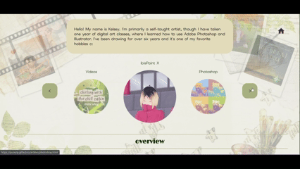

# artkive
A fun and personalized archive of my favorite works from the past few years across different platforms/mediums including Adobe Photoshop, Illustrator, ibisPaint, and CapCut.

## Quick Start

**Take a look at my website [here!](https://puoiyip.github.io/artkive/)**
(Or here: https://puoiyip.github.io/artkive/)

## Features
- Navigation: click on the green left and right arrows to find links to the other pages
- Home button: click on the top-right home button to go back to the home page
- Home page: gives an overview of all my art (aside from videos); click on the images to see them larger
- ibisPaint x: click "next" and "previous" to flip through the pages
- Photoshop and Illustrator: click on "artist statement" to view an explanation of my process; click on it again (or "art") to go back to the image

## How it Works
My website relies on JavaScript functions to toggle between various images, as seen in the navigation bar and the pages that display my artwork. I made use of the .getElementsByClassName() and .getElementsByTagName() methods to efficiently traverse all the images I had in my website. This will allow me to easily remove or add images in the future. 

I combined this interactivity with CSS to make the website feel more cohesive. For instance, I employed the transition property throughout the project to add fluidity, and I created modals to display images in full size and additional information about some of my works. I also made use of some animation properties for the ibisPaint page to make it more enticing and to enhance the artistic aspect of my works. Moreover, I utilized CSS media queries to make my website more mobile-compatible. I ultimately chose to remove certain features and replace the navigation bar with a dropdown menu to optimize the space on mobile devices, which have smaller screens than computers do. 

## Acknowledgements

I would like to thank my sister and friends who tested and gave me valuable feedback on my website. Special thanks to my friend who helped me write my first README!